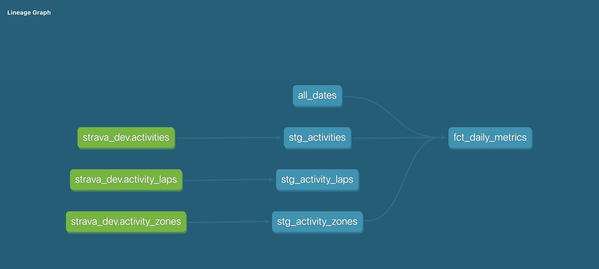
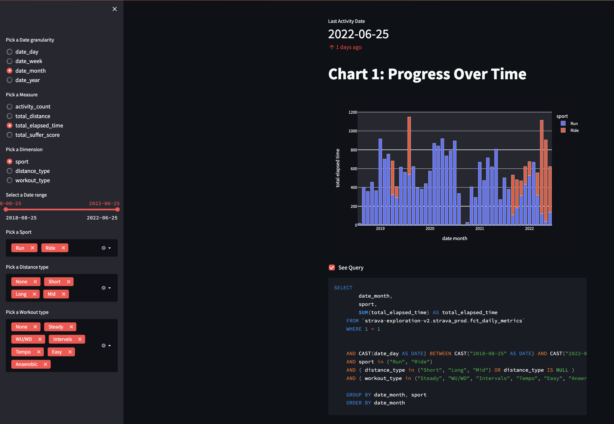

## Motivation 💡

- To get hands-on exposure to a modern ELT tech-stack that incorperates DBT and a Cloud Platform.
- To enhance the reporting provided out-of-the-box by Strava.
  - Filter and group my activities using my own custom activity types.
  - Track my training volume and load across multiple sports in one consolidated view.
  - Aggregrate the time I spend in different HR and pace zones over time.
  - Benchmark my performance over time for specific races and training segments.

## Project Plan 🤓

1. Use the [Strava API](https://developers.strava.com/docs/reference/) to collect my personal running data. ✅
2. Use a cloud-based data warehousing platform to store the data. ✅
3. Use DBT to test, transform and document the data. ✅
4. Use a browser-based reporting tool to vizualise the data. ✅
5. Use CI/CD to automate the developement flow. ✅
6. Use cloud automation to refresh the data daily. ✅

## Tech Stack 👨‍💻

- Python ✅
- GCP
  -  Cloud Storage ✅
  -  Big Query ✅
  -  Container Registry ✅
  -  Cloud Run ✅
  -  Cloud Scheduler ✅
- dbt ✅
- Streamlit ✅
- GitHub Actions ✅
- Docker ✅

## Data Pipeline 

## CI/CD 

## [DBT Schema](https://github.com/jackbustertann/dbt_bq_strava_exploration_v2) 🗄️

## [Streamlit App](https://github.com/jackbustertann/strava_exploration_streamlit_app) 📈

## Next Steps 🚀

- Improve reliability of data pipeline
  - Write unit tests for all modules
  - Write data quality tests for all tables
  - Add logging to code
- Improve usefulness of reporting 
  - Collect data from new API endpoints
    - Segments
    - Activity streaming
    - Club activities
  - Create new data models in dbt
  - Create new pages in Streamlit App
- Improve scalability of GCP infrastructure
  - Manage infrastructure as code using Terraform

