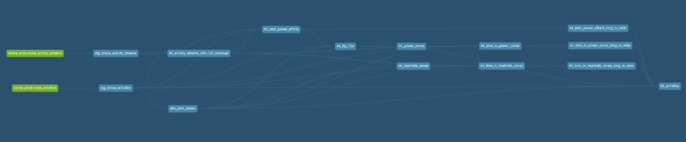

## Motivation 💡

- To get hands-on exposure to a modern ELT tech-stack that incorperates dbt and a cloud platform.
- To enhance the reporting provided out-of-the-box by Strava.
  - Create a 90-day view to benchmark different aspects of my training, such as volume, intensity and performance.
  - Create my own activity types, such as intervals (road/track/virtual) and races (road/XC/virtual), to filter and group my activities.
  - Define my own sport-specific metrics such as best power efforts (cycling) and time in pace zones (running).
  - Aggregate my activity metrics across multiple sports into one consolidated view.

## Project Plan 🤓

1. Use the [Strava API](https://developers.strava.com/docs/reference/) to collect my personal running data. ✅
2. Use a cloud-based data warehousing platform to store the data. ✅
3. Use DBT to transform, test and document the data. ✅
4. Use CI/CD to automate the deployment flow. ✅
5. Use cloud automation to refresh the data daily. ✅
6. Use a browser-based reporting tool to vizualise the data. 🚧 

## Tech Stack 👨‍💻

- Python 
- GCP
  -  Cloud Storage 
  -  Big Query 
  -  Container Registry 
  -  Cloud Run 
  -  Cloud Scheduler 
- GitHub Actions 
- Docker 
- dbt
- Streamlit 

## Data Pipeline

TODO: add activity streams endpoint

## CI/CD 

## [DBT Lineage](https://github.com/jackbustertann/dbt_bq_strava_exploration_v2) 🗄️

## [Steamlit Web App](https://jackbustertann-strava-exploration-streamlit-app-app-xh16o5.streamlit.app/)

## Future Optimisations 🚀

- In-corperate activity streams data source into data model. ✅
  - Define custom HR, power and pace zones that update dynamically over time.
    - HR -> age
    - power -> FTP
    - pace -> 5k race times
  - Calculate time in HR, power and pace zones.
  - Calculate best 15", 1', 5', 10' and 20' power efforts.
- Extend DBT functionality across project.
  - Re-factor code using jinja and macros. ✅
  - Reduce build time using incremental models. ✅
  - Define re-usable and consistent metrics using the MetricFlow.
  - Detect data quality and source freshness issues using tests.
- Trigger DBT refresh job on detection of file.
- Manage cloud infrastructure as code using Terraform.
- Manage/Schedule data injestion pipelines in Airflow.

